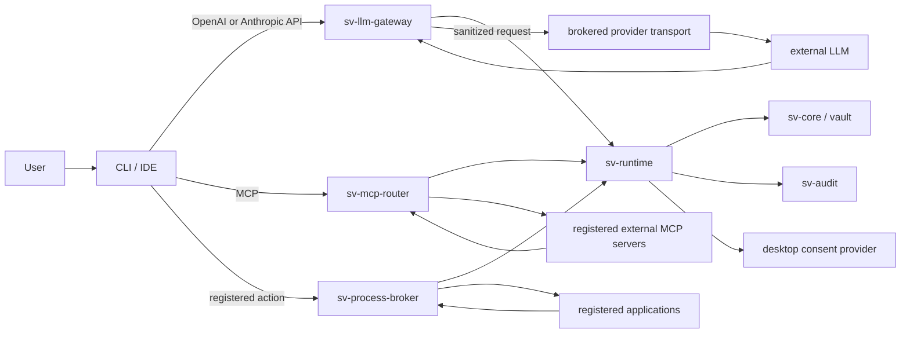

# Runtime Mediation Architecture

## 1. Objective

The runtime stack provides one policy language and one auditable decision path
for five exposure routes:

1. PII typed directly into a prompt;
2. content injected by a plugin before a model call;
3. files read by native client tools;
4. commands and application processes that need secrets;
5. results returned by another MCP server.

The stack allows the model to reason about desired actions using sanitized
facts and opaque references. The final application action is executed locally
after the runtime validates the exact principal, destination, parameters,
policy, and consent.

## 2. Logical topology



`sv-runtime` is a library, not another externally reachable service. Gateway,
router, and broker call it in-process so policy cannot be bypassed through an
unprotected internal RPC port.

## 3. Trust zones

| Zone | Trust | Examples |
|---|---|---|
| Human control plane | trusted root | desktop approval, policy administration |
| Rust mediation process | trusted while unlocked | runtime, gateway, router, broker |
| Local clients | untrusted | Codex, Claude Code, OpenCode, plugins |
| External MCP servers | untrusted by default | local subprocess or remote HTTP MCP |
| Registered applications | constrained, not trusted with unrelated secrets | `git`, deployment CLI, database client |
| External providers/network | untrusted | model APIs and remote application APIs |
| Local storage/backups | untrusted medium | encrypted vault and authenticated audit |

The existing threat model treats a fully compromised same-user account as out
of scope. The runtime reduces accidental and agent-driven disclosure within
that boundary; it does not overturn the assumption.

## 4. Control plane and data plane

The **control plane** manages:

- client identities and scoped credentials;
- policy bundles and versions;
- provider routes;
- external MCP registrations;
- process profiles;
- opaque reference classes;
- consent providers;
- audit keys and retention settings.

The **data plane** handles individual requests. Control-plane mutations require
trusted local UI/CLI authorization and are never accepted from model-generated
tool arguments.

## 5. Canonical mediation stages

Every adapter converts external wire data into a common `MediationRequest`.
Stages are deterministic and ordered:

1. Authenticate the client credential and bind a principal/session.
2. Normalize protocol-specific content without discarding unknown fields.
3. Apply structural limits before parsing large bodies or streams.
4. Derive origin, destination, operation, and data fragments.
5. Enforce principal scopes and resource/profile registrations.
6. Scan and label supported text; mark unsupported content `unknown`.
7. Resolve opaque references to metadata only: class, owner, expiry, allowed
   uses, and destination constraints.
8. Evaluate policy using deny-overrides and elevation-only composition.
9. Create an operation digest and obtain bound consent when required.
10. Apply transformations: redaction, stable per-session pseudonyms, omission,
    or reference substitution.
11. Append an authenticated audit-intent event.
12. Route to the provider, MCP server, or process broker. Secret bytes are
    resolved only inside the final trusted executor.
13. Normalize and sanitize response/result content.
14. Append outcome and release-summary events.
15. Release only the transformed result.

## 6. Core flows

### 6.1 Prompt containing PII

```text
user prompt -> client -> gateway -> fragment scan
-> policy requires redaction -> replace spans with session pseudonyms
-> audit counts/digest -> model receives sanitized prompt
-> response is sanitized -> client
```

The substitution map stays local and is scoped to the session and destination.
The model may refer to `[PERSON_1]`; the gateway can restore a value only for a
user-visible local response when policy explicitly permits it. It never restores
PII into a provider-bound request.

### 6.2 Plugin or native-tool content

If the plugin/tool result is included in the next model request, the gateway
sees and sanitizes the model-bound copy. The adapter should attach provenance
metadata when the client supports hooks. Without that metadata the gateway can
still scan the text but cannot reliably distinguish a file result from user
text. The action that read the file is independently controlled only when a
hook or routed tool surface exists.

### 6.3 Secret-backed action

```text
model sees: "deploy using svref:v1:..."
model calls: sovereign.process.run(profile="deploy-prod", refs=[...])
router/runtime: validate principal + profile + destination + arguments
desktop: approve exact bound operation if policy requires
process broker: resolve ref, inject secret, execute profile
output sanitizer: remove echoes/PII -> model receives safe result
```

### 6.4 External MCP result

The client connects only to `sv-mcp-router`. The router namespaces external
tools, verifies the registered server and tool schema, filters arguments,
invokes the server, labels every returned content block with provenance, and
sanitizes it before returning it to the client or model.

### 6.5 Provider request

The client authenticates to the local gateway with a local token. That token is
not a provider key. The gateway sanitizes the request and passes a provider
route plus sanitized body to the broker. The broker retrieves the provider
credential from the vault, validates the route allowlist, adds the auth header,
and streams the response back through the egress sanitizer.

## 7. Deployment topologies

### Desktop integrated — recommended initial topology

The Tauri Rust process owns the unlocked vault and starts gateway/router
listeners on loopback. Consent remains in-process. Locking stops listeners,
invalidates sessions/references, and cancels active work.

### Headless user service — later topology

A signed Rust daemon owns the unlocked session and exposes a local named pipe or
Unix socket. A separate desktop client supplies consent. This requires a new
authenticated IPC design and is not implied by the initial implementation.

### Standalone CLI — limited topology

A foreground `sovereign-vault runtime serve` command can run the stack for one
terminal session. Interactive consent is terminal-based or denied according to
policy. It must not silently substitute auto-approval.

## 8. State and lifetime

| State | Persistence | Requirement |
|---|---|---|
| client identities/scopes | authenticated vault state | revocable and versioned |
| policies/profiles/routes | authenticated configuration | atomic updates and rollback visibility |
| opaque reference metadata | memory by default | invalidated on lock/session end |
| pseudonym map | memory only | per session and destination |
| consent grants | memory plus audit digest | short-lived, single operation unless explicit lease |
| raw request/response | never persisted by runtime | bounded lifetime |
| audit events | authenticated append-only log | no raw protected values |

## 9. Availability and failure policy

- Locked vault: reject secret-backed operations; optionally allow explicitly
  public, no-vault routes only if policy says so.
- Runtime unavailable: adapters fail closed for protected routes.
- Sanitizer error or unsupported content: deny that fragment/request.
- Consent UI unavailable: deny operations requiring consent.
- Audit intent cannot be durably appended: deny release.
- Outcome audit failure after an irreversible external action: return a
  distinct `executed_audit_incomplete` error, stop further actions, and surface
  an operator incident. Do not falsely report that execution did not occur.
- Client disconnect: cancel upstream work where safe; record cancellation.

## 10. Compatibility principle

Protocol fidelity and privacy are both required. Unknown fields cannot be
silently removed, and unknown content cannot be silently passed. The correct
behavior is a typed compatibility error naming the unsupported feature without
echoing its protected value.

