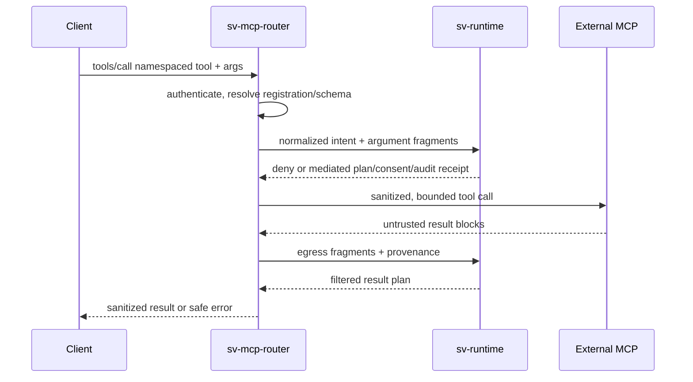

# `sv-mcp-router` Specification

## 1. Responsibility

`sv-mcp-router` is both:

- the MCP server exposed to CLIs/IDEs; and
- an MCP client for explicitly registered external servers.

It presents one namespaced capability surface, dispatches Sovereign Vault tools
locally, mediates external tools/resources/prompts, filters all returned
content, and routes every decision through `sv-runtime`.

The existing `sv-mcp` crate remains the local Sovereign Vault tool backend in
the first migration phase. The new router composes it rather than performing a
risky immediate rename/rewrite.

## 2. Public MCP surface

Namespaces:

- `sovereign.vault.*` — existing vault/transit/signing/broker capabilities;
- `sovereign.reference.*` — safe reference creation/inspection/revocation;
- `sovereign.process.*` — registered process profiles;
- `external.<server-id>.<tool>` — allowed registered external tools.

Legacy `vault.*` names may be aliased during migration. Aliases resolve to the
same runtime operation and audit identity.

The router supports the MCP protocol versions already supported by `sv-mcp`
and adds versions only through explicit conformance tests. Stdio is the initial
client-facing transport; authenticated loopback HTTP can follow.

## 3. Registration

External servers are disabled until registered by the trusted control plane.
A registration includes:

- stable server ID and operator label;
- transport: exact stdio executable/args or exact remote HTTPS origin;
- expected protocol/capabilities;
- tool allow/deny patterns;
- prompt/resource allow rules;
- authentication reference and destination constraints;
- environment allowlist and working directory for stdio;
- request/response/time/concurrency limits;
- result policy ID;
- last approved tool-schema digest set;
- enabled/revoked state.

The model cannot add or modify registrations.

## 4. Discovery mediation

### `tools/list`

1. Query enabled servers within limits.
2. Treat names, descriptions, and schemas as untrusted.
3. Validate identifiers and JSON Schema subset.
4. Filter against registration and principal scope.
5. Namespace tool names deterministically.
6. Calculate a schema digest.
7. If a previously approved schema changed, disable the affected tool and
   require operator review.
8. Sanitize descriptions before exposing them to a model.

Descriptions never create permissions. A server claiming “safe” or “requires
admin” changes no runtime rule.

### Resources and prompts

`resources/list`, `resources/read`, `prompts/list`, and `prompts/get` follow the
same registration, scope, size, provenance, and sanitization path. Resource
URIs are opaque server identifiers, not arbitrary URLs fetched by the router.

## 5. Tool-call mediation

Arguments are parsed completely and validated against the approved schema.
Strings, nested JSON, resource links, and embedded content are separate
fragments for policy. Opaque references remain references unless the target is
a trusted local executor specifically authorized to resolve them.

## 6. Local Sovereign Vault tools

Local dispatch reuses `sv-mcp` operations but moves common decisions to
`sv-runtime` incrementally:

1. router authenticates principal;
2. runtime evaluates scopes/policy/consent/audit;
3. typed local backend executes with an execution lease;
4. runtime filters any plaintext result;
5. router serializes MCP result.

During migration, duplicate enforcement in `sv-mcp` remains defense-in-depth.
It must not be removed until equivalence tests demonstrate the runtime path.

Secret-returning `vault.read` remains possible only for resources whose
configured exposure class permits reveal. Broker-only and non-exportable
resources return a reference or operation result, never raw bytes.

## 7. Result filtering

Every MCP content block is untrusted:

- text: scan/redact/pseudonymize/deny;
- JSON/structured content: recursively mediate string leaves and sensitive
  keys, retaining types;
- resource links: return only registered safe metadata; do not auto-fetch;
- embedded text resources: treat as external MCP content;
- images/audio/binary: deny until typed filters and limits exist;
- tool-generated errors: map to safe error codes; never pass raw stack traces;
- annotations: drop or allowlist; never trust audience/priority as policy.

The router adds authenticated provenance outside the content block so later
gateway sanitization can distinguish external MCP results.

## 8. Prompt-injection handling

Sanitization cannot determine whether arbitrary natural-language content is
malicious. The router therefore combines:

- provenance labels visible to policy/client;
- isolation delimiters in model-facing serialization;
- least-privilege tool exposure;
- denial of tool/schema changes;
- consent for consequential calls;
- opaque references for protected material;
- no automatic execution of instructions contained in tool results.

This reduces consequences; it does not claim to detect all prompt injection.

## 9. External server process handling

Stdio MCP servers are launched through a restricted process profile, not a
free-form command from project configuration. They receive an allowlisted
environment and no vault/provider credentials unless a specific execution-only
mapping exists. Stderr is bounded and sanitized; it is not forwarded to the
model or persisted raw.

Remote HTTP servers use broker destination controls: HTTPS, exact origin/path,
SSRF protection, no redirects by default, bounded response, and late-bound
authentication.

## 10. Lifecycle and failures

- server start/stop/restart is audited without command-line secrets;
- crash disables the server until policy-defined restart budget permits retry;
- capability/schema change disables affected tools;
- timeout/cancel maps to a safe MCP result and outcome audit;
- malformed frames count toward a circuit breaker;
- partial or oversized results are discarded, not truncated into potentially
  misleading success;
- router lock closes server sessions and invalidates references/grants.

## 11. Acceptance criteria

- Existing Sovereign Vault MCP behavior remains compatible through aliases.
- Unregistered servers/tools/resources/prompts cannot be reached.
- Schema mutation, namespace collision, malformed JSON-RPC, oversized frames,
  and result injection fail closed.
- All content-block variants have an explicit allow/filter/deny decision.
- External MCP fixtures prove no vault/provider credential enters their env,
  args, stdin, requests, logs, or errors unless the exact registered operation
  requires it.
- Direct-client configuration bypass is detected and reported by each adapter.

